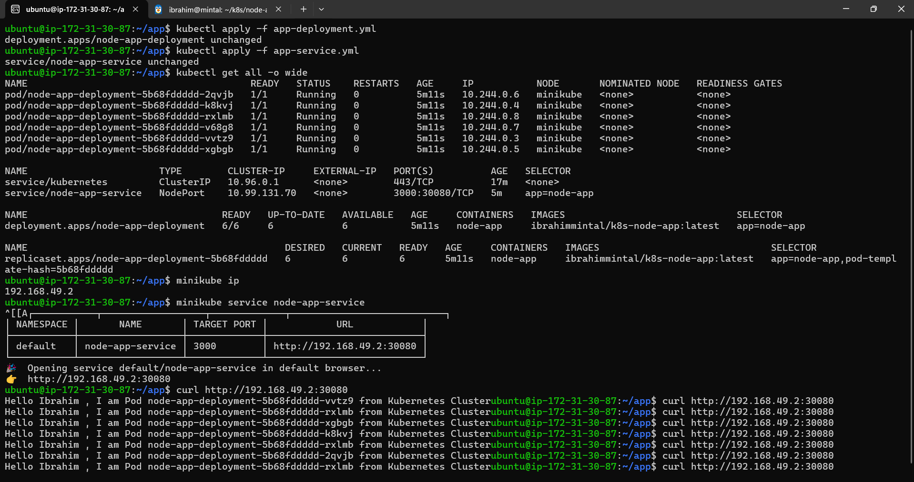

# Node App K8s

A simple Node.js Express application deployed on Kubernetes.

## Description

This project demonstrates a basic Express.js server that responds with a greeting including the pod's hostname, showcasing Kubernetes pod identification.

## Prerequisites

- Node.js (version 20 or later)
- Docker
- Kubernetes cluster (e.g., Minikube)
- kubectl

## Local Development

1. Navigate to the app directory:
   ```
   cd app
   ```

2. Install dependencies:
   ```
   npm install
   ```

3. Run the application:
   ```
   npm start
   ```

4. Access at http://localhost:3000

## Docker Build

1. Build the Docker image:
   ```
   docker build -t your-registry/node-app:latest app/
   ```

2. Push to registry (replace with your registry):
   ```
   docker push your-registry/node-app:latest
   ```

## Kubernetes Deployment

1. Apply the deployment:
   ```
   kubectl apply -f app-deployment.yml
   ```

2. Apply the service:
   ```
   kubectl apply -f app-service.yml
   ```

3. Check pods:
   ```
   kubectl get pods
   ```

## Access the Application

- Via kubectl port-forward: `kubectl port-forward svc/node-app-service 3000:3000` then http://localhost:3000

## Testing



Note: Update the image in app-deployment.yml to your built image.
